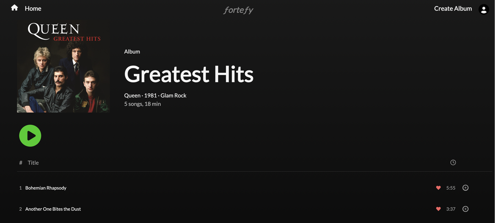

# ƒorteƒy Music Player

# Description
ƒorteƒy is a full-stack web application that allows users to explore and enjoy their favorite music. The application offers a user-friendly interface with login and signup functionality, enabling users to create their personalized accounts and access exclusive features. The site is modelled off of Spotify's design.
- Project-URL https://fortefy.onrender.com/
# Technologies Used
- Frontend:
    - React
    - Redux
    - Javascript
    - HTML
    - CSS

- Backend:
    - Python
    - Flask
# Key Features
- User Authentication:
Users can sign up and log in to their accounts.
Authentication is handled using a secure login system that hashes each stored password.
- New account creation, log in, log out, and guest/demo login
  - Users can sign up, log in, and log out.
  - Users can use a demo log in to try the site.
  - Users can't use certain features without logging in (like playlists and user likes, read only for songs and albums).
  - Logged in users are directed to their profile page which displays either a list of uploads, playlists, and or likes.
  - Logged out users are directed to a page displaying all public playlists.

## Songs
  - Users can create Songs.
  - Users can read/view Songs.
  - Users can update their uploaded Songs.
  - Users can delete their uploaded Songs.

## Albums
  - Users can create/add songs to an album that they created.
  - Users can read/view all albums.
  - Users can remove songs from their albums.
  - Users should be able to delete their albums.

## Likes
  - Users can create/add a like to a song.
  - Users can read/view their like on a song.
  - Users can unlike/remove their like from a song.

## Playlists
  - Users can view all of their playlists.
  - Users can create a playlist.
  - Users can add a song to one of their playlists.
  - Users can remove a song from their playlist.

## AWS
  - Album artwork and song url are both handled utilizing AWS to allow a more seemless user experience.

# Screenshots:




# Media Player:

Users can listen to songs and albums directly on the website. Song play persists through all pages and closes when the current playlist queue ends.
The React H5 Audio Player https://www.npmjs.com/package/react-h5-audio-player was utilized for this project.

# Responsive Design:

The website is fully responsive and works on various screen sizes.

# API Documentation

## Albums

### Get all Albums

Returns all albums in the database

* Require Authentication: false
* Request
  * Method: GET
  * URL: /api/albums
  * Body: None

* Response
    * Status Code: 200
    * Headers:
        * Content-Type: application/json
    * Body:

    ```json
    [
    {
        "art": "https://fortefy-song-url.s3.us-east-2.amazonaws.com/Pink+Floyd/The+Dark+Side+of+the+Moon/The+Dark+Side+of+the+Moon.jpg",
        "artist": "Pink Floyd",
        "genre": "Psychedelic Rock",
        "id": 1,
        "name": "The Dark Side of the Moon",
        "songs": [
            {
                "album_art": "https://fortefy-song-url.s3.us-east-2.amazonaws.com/Pink+Floyd/The+Dark+Side+of+the+Moon/The+Dark+Side+of+the+Moon.jpg",
                "album_id": 1,
                "artist": "Pink Floyd",
                "duration": 65,
                "id": 1,
                "likes": [],
                "name": "Speak to Me",
                "song_url": "https://fortefy-song-url.s3.us-east-2.amazonaws.com/Pink+Floyd/The+Dark+Side+of+the+Moon/Speak+to+Me.mp3",
                "track_number": 1,
                "user": {
                    "email": "demo@aa.io",
                    "id": 1,
                    "username": "Demo"
                },
                "user_id": 1
            },
            {
                "album_art": "https://fortefy-song-url.s3.us-east-2.amazonaws.com/Pink+Floyd/The+Dark+Side+of+the+Moon/The+Dark+Side+of+the+Moon.jpg",
                "album_id": 1,
                "artist": "Pink Floyd",
                "duration": 169,
                "id": 2,
                "likes": [],
                "name": "Breathe (In the Air)",
                "song_url": "https://fortefy-song-url.s3.us-east-2.amazonaws.com/Pink+Floyd/The+Dark+Side+of+the+Moon/Breathe+(In+the+Air).mp3",
                "track_number": 2,
                "user": {
                    "email": "demo@aa.io",
                    "id": 1,
                    "username": "Demo"
                },
                "user_id": 1
            }
        ],
        "user": {
            "email": "demo@aa.io",
            "id": 1,
            "username": "Demo"
        },
        "year": 1973
    }
    ]
    ```

### Get a single Album

Returns a single album in the database

* Require Authentication: false
* Request
  * Method: GET
  * URL: /api/albums/:id
  * Body: None

* Response
    * Status Code: 200
    * Headers:
        * Content-Type: application/json
    * Body:

    ```json
    {
    "art": "https://fortefy-song-url.s3.us-east-2.amazonaws.com/Pink+Floyd/The+Dark+Side+of+the+Moon/The+Dark+Side+of+the+Moon.jpg",
    "artist": "Pink Floyd",
    "genre": "Psychedelic Rock",
    "id": 1,
    "name": "The Dark Side of the Moon",
    "songs": [
        {
            "album_art": "https://fortefy-song-url.s3.us-east-2.amazonaws.com/Pink+Floyd/The+Dark+Side+of+the+Moon/The+Dark+Side+of+the+Moon.jpg",
            "album_id": 1,
            "artist": "Pink Floyd",
            "duration": 65,
            "id": 1,
            "likes": [],
            "name": "Speak to Me",
            "song_url": "https://fortefy-song-url.s3.us-east-2.amazonaws.com/Pink+Floyd/The+Dark+Side+of+the+Moon/Speak+to+Me.mp3",
            "track_number": 1,
            "user": {
                "email": "demo@aa.io",
                "id": 1,
                "username": "Demo"
            },
            "user_id": 1
        },
        {
            "album_art": "https://fortefy-song-url.s3.us-east-2.amazonaws.com/Pink+Floyd/The+Dark+Side+of+the+Moon/The+Dark+Side+of+the+Moon.jpg",
            "album_id": 1,
            "artist": "Pink Floyd",
            "duration": 169,
            "id": 2,
            "likes": [],
            "name": "Breathe (In the Air)",
            "song_url": "https://fortefy-song-url.s3.us-east-2.amazonaws.com/Pink+Floyd/The+Dark+Side+of+the+Moon/Breathe+(In+the+Air).mp3",
            "track_number": 2,
            "user": {
                "email": "demo@aa.io",
                "id": 1,
                "username": "Demo"
            },
            "user_id": 1
        }
    ],
    "user": {
        "email": "demo@aa.io",
        "id": 1,
        "username": "Demo"
    },
    "year": 1973
    }
    ```


# Contributors
Alex Basso
https://www.linkedin.com/in/joshua-hoang-47979426b/

Angad Bhatia
https://www.linkedin.com/in/angad-bhatia/

Joshua Hoang
https://www.linkedin.com/in/alexjbasso

Bryant Stine
https://www.linkedin.com/in/bryant-stine/
