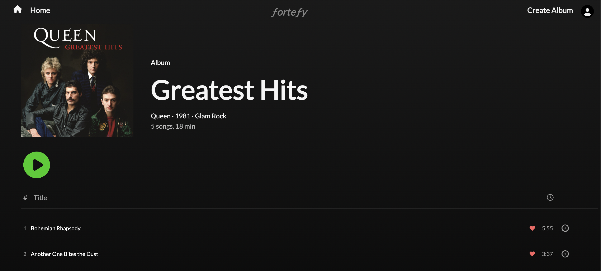

# ƒorteƒy Music Player

# Description
ƒorteƒy is a full-stack web application that allows users to explore and enjoy their favorite music. The application offers a user-friendly interface with login and signup functionality, enabling users to create their personalized accounts and access exclusive features. The site is modelled off of Spotify's design.
- Project-URL https://fortefy.onrender.com/
# Technologies Used
- Frontend:
    - React
    - Redux
    - Javascript
    - HTML
    - CSS

- Backend:
    - Python
    - Flask
# Key Features
- User Authentication:
Users can sign up and log in to their accounts.
Authentication is handled using a secure login system that hashes each stored password.
- New account creation, log in, log out, and guest/demo login
  - Users can sign up, log in, and log out.
  - Users can use a demo log in to try the site.
  - Users can sign up or log in with their Google account (OAuth), from either the log in or the sign up modal.
  - Users can't use certain features without logging in (like playlists and user likes, read only for songs and albums).
  - Logged in users are directed to their profile page which displays either a list of uploads, playlists, and or likes.
  - Logged out users are directed to a page displaying all public playlists.

## Songs
  - Users can create Songs.
  - Users can read/view Songs.
  - Users can update their uploaded Songs.
  - Users can delete their uploaded Songs.

## Albums
  - Users can create/add songs to an album that they created.
  - Users can read/view all albums.
  - Users can remove songs from their albums.
  - Users should be able to delete their albums.

## Likes
  - Users can create/add a like to a song.
  - Users can read/view their like on a song.
  - Users can unlike/remove their like from a song.
  - Users can view and play every song they have liked in an auto-generated "Liked Songs" playlist.

## Playlists
  - Users can view all of their playlists.
  - Users can create a playlist.
  - Users can add a song to one of their playlists.
  - Users can remove a song from their playlist.

## Search
  - Users can search for songs by song name or artist.
  - Users can search for albums by album name or artist.
  - Users can view the results of their search, play any matching song, and jump to any matching album.

## AWS
  - Album artwork and song url are both handled utilizing AWS to allow a more seemless user experience.

# Screenshots:




# Media Player:

Users can listen to songs and albums directly on the website. Song play persists through all pages and closes when the current playlist queue ends.
The React H5 Audio Player https://www.npmjs.com/package/react-h5-audio-player was utilized for this project.

# Responsive Design:

The website is fully responsive and works on various screen sizes.

# API Documentation

## Albums

### Get all Albums

Returns all albums in the database

* Require Authentication: false
* Request
  * Method: GET
  * URL: /api/albums
  * Body: None

* Response
    * Status Code: 200
    * Headers:
        * Content-Type: application/json
    * Body:

    ```json
    [
    {
        "art": "https://fortefy-song-url.s3.us-east-2.amazonaws.com/Pink+Floyd/The+Dark+Side+of+the+Moon/The+Dark+Side+of+the+Moon.jpg",
        "artist": "Pink Floyd",
        "genre": "Psychedelic Rock",
        "id": 1,
        "name": "The Dark Side of the Moon",
        "songs": [
            {
                "album_art": "https://fortefy-song-url.s3.us-east-2.amazonaws.com/Pink+Floyd/The+Dark+Side+of+the+Moon/The+Dark+Side+of+the+Moon.jpg",
                "album_id": 1,
                "artist": "Pink Floyd",
                "duration": 65,
                "id": 1,
                "likes": [],
                "name": "Speak to Me",
                "song_url": "https://fortefy-song-url.s3.us-east-2.amazonaws.com/Pink+Floyd/The+Dark+Side+of+the+Moon/Speak+to+Me.mp3",
                "track_number": 1,
                "user": {
                    "email": "demo@aa.io",
                    "id": 1,
                    "username": "Demo"
                },
                "user_id": 1
            },
            {
                "album_art": "https://fortefy-song-url.s3.us-east-2.amazonaws.com/Pink+Floyd/The+Dark+Side+of+the+Moon/The+Dark+Side+of+the+Moon.jpg",
                "album_id": 1,
                "artist": "Pink Floyd",
                "duration": 169,
                "id": 2,
                "likes": [],
                "name": "Breathe (In the Air)",
                "song_url": "https://fortefy-song-url.s3.us-east-2.amazonaws.com/Pink+Floyd/The+Dark+Side+of+the+Moon/Breathe+(In+the+Air).mp3",
                "track_number": 2,
                "user": {
                    "email": "demo@aa.io",
                    "id": 1,
                    "username": "Demo"
                },
                "user_id": 1
            }
        ],
        "user": {
            "email": "demo@aa.io",
            "id": 1,
            "username": "Demo"
        },
        "year": 1973
    }
    ]
    ```

### Get a single Album

Returns a single album in the database

* Require Authentication: false
* Request
  * Method: GET
  * URL: /api/albums/:id
  * Body: None

* Response
    * Status Code: 200
    * Headers:
        * Content-Type: application/json
    * Body:

    ```json
    {
    "art": "https://fortefy-song-url.s3.us-east-2.amazonaws.com/Pink+Floyd/The+Dark+Side+of+the+Moon/The+Dark+Side+of+the+Moon.jpg",
    "artist": "Pink Floyd",
    "genre": "Psychedelic Rock",
    "id": 1,
    "name": "The Dark Side of the Moon",
    "songs": [
        {
            "album_art": "https://fortefy-song-url.s3.us-east-2.amazonaws.com/Pink+Floyd/The+Dark+Side+of+the+Moon/The+Dark+Side+of+the+Moon.jpg",
            "album_id": 1,
            "artist": "Pink Floyd",
            "duration": 65,
            "id": 1,
            "likes": [],
            "name": "Speak to Me",
            "song_url": "https://fortefy-song-url.s3.us-east-2.amazonaws.com/Pink+Floyd/The+Dark+Side+of+the+Moon/Speak+to+Me.mp3",
            "track_number": 1,
            "user": {
                "email": "demo@aa.io",
                "id": 1,
                "username": "Demo"
            },
            "user_id": 1
        },
        {
            "album_art": "https://fortefy-song-url.s3.us-east-2.amazonaws.com/Pink+Floyd/The+Dark+Side+of+the+Moon/The+Dark+Side+of+the+Moon.jpg",
            "album_id": 1,
            "artist": "Pink Floyd",
            "duration": 169,
            "id": 2,
            "likes": [],
            "name": "Breathe (In the Air)",
            "song_url": "https://fortefy-song-url.s3.us-east-2.amazonaws.com/Pink+Floyd/The+Dark+Side+of+the+Moon/Breathe+(In+the+Air).mp3",
            "track_number": 2,
            "user": {
                "email": "demo@aa.io",
                "id": 1,
                "username": "Demo"
            },
            "user_id": 1
        }
    ],
    "user": {
        "email": "demo@aa.io",
        "id": 1,
        "username": "Demo"
    },
    "year": 1973
    }
    ```

## Search

### Search Songs and Albums

Returns the songs whose name or artist contains the search term, and the albums whose name or artist contains the search term. Matching is case-insensitive. Results whose name starts with the term are listed first, then the rest alphabetically, up to 50 of each. A blank term returns empty lists.

* Require Authentication: false
* Request
  * Method: GET
  * URL: /api/search?q=:term
  * Body: None

* Response
    * Status Code: 200
    * Headers:
        * Content-Type: application/json
    * Body:

    ```json
    {
    "songs": [
        {
            "album_art": "https://fortefy-song-url.s3.us-east-2.amazonaws.com/Pink+Floyd/The+Dark+Side+of+the+Moon/The+Dark+Side+of+the+Moon.jpg",
            "album_id": 1,
            "album_name": "The Dark Side of the Moon",
            "artist": "Pink Floyd",
            "duration": 169,
            "id": 2,
            "likes": [],
            "name": "Breathe (In the Air)",
            "song_url": "https://fortefy-song-url.s3.us-east-2.amazonaws.com/Pink+Floyd/The+Dark+Side+of+the+Moon/Breathe+(In+the+Air).mp3",
            "track_number": 2,
            "user": {
                "email": "demo@aa.io",
                "id": 1,
                "username": "Demo"
            },
            "user_id": 1
        }
    ],
    "albums": [
        {
            "art": "https://fortefy-song-url.s3.us-east-2.amazonaws.com/Pink+Floyd/The+Dark+Side+of+the+Moon/The+Dark+Side+of+the+Moon.jpg",
            "artist": "Pink Floyd",
            "genre": "Psychedelic Rock",
            "id": 1,
            "name": "The Dark Side of the Moon",
            "songs": [],
            "user": {
                "email": "demo@aa.io",
                "id": 1,
                "username": "Demo"
            },
            "year": 1973
        }
    ]
    }
    ```

## Installation Instructions

1. Install dependencies
```bash
pipenv install -r requirements.txt
```
2. Create a **.env** file based on the example with proper settings for your development environment

4. Replace the value for `SCHEMA` with a unique name, **making sure you use the snake_case convention**.

6. Get into your pipenv, migrate your database, seed your database, and run your Flask app

```bash
pipenv shell
```
```bash
flask db upgrade
```
```bash
flask seed all
```
```bash
flask run
```

7. To run the React App in development, checkout the [README](./react-app/README.md) inside the `react-app` directory.

## Setting up Google Login (optional)

The "Continue with Google" buttons only appear once the server has Google
credentials, so the app runs fine without doing any of this.

1. In the [Google Cloud console](https://console.cloud.google.com/apis/credentials),
   create an **OAuth client ID** of type **Web application**.

2. Add an **Authorized redirect URI** that matches where your Flask app is running:

   | Running | Redirect URI |
   | --- | --- |
   | Flask serving the React build (`flask run`) | `http://localhost:5000/api/auth/oauth/google/callback` |
   | React dev server in front of Flask (`npm start`) | `http://localhost:3000/api/auth/oauth/google/callback` |
   | Production | `https://<your-domain>/api/auth/oauth/google/callback` |

3. Put the client ID and secret in your **.env**:

```bash
GOOGLE_CLIENT_ID=your-client-id.apps.googleusercontent.com
GOOGLE_CLIENT_SECRET=your-client-secret
```

4. Only when you are using the React dev server, also set `GOOGLE_REDIRECT_URI`.
   Flask sees itself on port 5000 and cannot tell that the browser is on port
   3000, so it needs to be told which URL to send Google back to:

```bash
GOOGLE_REDIRECT_URI=http://localhost:3000/api/auth/oauth/google/callback
```

Signing in with a Google account whose email already has a ƒorteƒy account links
the two, so that account keeps working with either its password or Google.


# Contributors
Alex Basso
https://www.linkedin.com/in/alexjbasso

Angad Bhatia
https://www.linkedin.com/in/angad-bhatia/

Joshua Hoang
https://www.linkedin.com/in/joshua-hoang-47979426b/

Bryant Stine
https://www.linkedin.com/in/bryant-stine/
