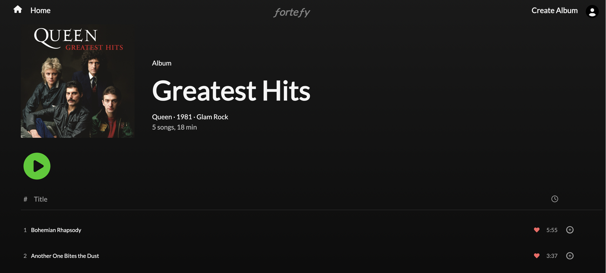

# ƒorteƒy Music Player

# Description
ƒorteƒy is a full-stack web application that allows users to explore and enjoy their favorite music. The application offers a user-friendly interface with login and signup functionality, enabling users to create their personalized accounts and access exclusive features. The site is modelled off of Spotify's design.
- Project-URL https://fortefy.onrender.com/
# Technologies Used
- Frontend:
    - React 19, with React Router 7
    - Redux
    - JavaScript, HTML and CSS
    - Vite

- Backend:
    - Python 3.12
    - Flask 3, with Flask-Login and Flask-WTF
    - SQLAlchemy 2: SQLite in development, Postgres in production
    - AWS S3, for uploaded songs
    - Google sign-in (OAuth), optional

# Key Features
## Accounts
  - Users can sign up, log in, and log out. Passwords are stored hashed.
  - Users can use a demo log in to try the site.
  - Users can sign up or log in with their Google account (OAuth), from either the log in or the sign up modal.
  - Anyone can browse and play every album, song and playlist. Liking songs, making playlists and uploading music need an account.
  - The home page shows every album, a shuffled row of songs to play, and every user's playlists. Logged in, it also shows the user's library: their Liked Songs and their own playlists.
  - The profile page ("Manage Your Music") lists the user's albums, songs and playlists, with buttons to edit and delete their albums and songs and to delete their playlists.

## Songs
  - Users can upload songs (MP3, M4A or WAV) to albums they created.
  - Users can listen to every song.
  - Users can rename and renumber their uploaded songs.
  - Users can delete their uploaded songs.

## Albums
  - Users can create albums, and edit and delete the ones they created.
  - Users can read/view all albums.
  - Users can add songs to their albums, and remove them.

## Likes
  - Users can create/add a like to a song.
  - Users can read/view their like on a song.
  - Users can unlike/remove their like from a song.
  - Users can view and play every song they have liked in an auto-generated "Liked Songs" playlist.

## Playlists
  - Users can view all of their playlists.
  - Users can create a playlist, and delete their playlists.
  - Users can add a song to one of their playlists.
  - Users can remove a song from their playlist.

## Search
  - Users can search for songs by song name or artist.
  - Users can search for albums by album name or artist.
  - Users can view the results of their search, play any matching song, and jump to any matching album.

## AWS
  - Uploaded songs are stored in AWS S3, and play straight from there.

# Screenshots:




# Media Player:

Users can listen to songs and albums directly on the website. Song play persists through all pages and closes when the current playlist queue ends.
The React H5 Audio Player https://www.npmjs.com/package/react-h5-audio-player was utilized for this project.

# Responsive Design:

The website is fully responsive and works on various screen sizes.

# Documentation

- [API reference](./documentation/api.md): every route, what it takes, and what it sends back.
- [Database schema](./documentation/database_schema.md): the tables and how they relate.
- [App structure](./documentation/app_structure.md): where things live in the repository.
- [Deploying to Render](./documentation/README.md#deploying-to-render).
- [Contributing](./CONTRIBUTING.md): the branch and pull request flow, tests, seed data and S3 credentials.

# Running locally

You need Python 3.12 and Node.js 24, the versions in `.python-version` and
`.node-version`.

1. Create a virtual environment and install the Python dependencies. On
   Windows, activate it with `.venv\Scripts\activate` instead.

   ```bash
   python -m venv .venv
   source .venv/bin/activate
   pip install -r requirements-dev.txt
   ```

2. Create a **.env** file from the example:

   ```bash
   cp .env.example .env
   ```

   Then set `SECRET_KEY` in it to a long random string, for example the output
   of `python -c "import secrets; print(secrets.token_hex(32))"`. The rest can
   stay as it is: `DATABASE_URL` points at a SQLite file, and `SCHEMA` only
   matters on Postgres in production. Uploading songs needs S3 credentials (see
   [Contributing](./CONTRIBUTING.md#s3-credentials)), and Google login needs the
   [setup below](#setting-up-google-login-optional); both are optional.

3. Create the database and fill it with the seed data:

   ```bash
   flask db upgrade
   flask seed all
   ```

4. Start Flask, which serves the API on http://localhost:5000:

   ```bash
   flask run
   ```

5. In a second terminal, install the frontend's dependencies and start its
   development server:

   ```bash
   npm install --prefix react-app
   npm start --prefix react-app
   ```

6. Open http://localhost:3000. The development server sends `/api` requests on
   to Flask. To log in, use the "Continue with Demo User" button.

Instead of steps 5 and 6, `npm run build --prefix react-app` builds the
frontend into `react-app/build`, which Flask then serves itself on
http://localhost:5000, the way production does. See the
[react-app README](./react-app/README.md) for the frontend's other commands.

## Setting up Google Login (optional)

The "Continue with Google" buttons only appear once the server has Google
credentials, so the app runs fine without doing any of this.

1. In the [Google Cloud console](https://console.cloud.google.com/apis/credentials),
   create an **OAuth client ID** of type **Web application**.

2. Add an **Authorized redirect URI** for each place the app runs. Paste these
   exactly, including the `http://` — Google rejects a URI whose host is not a
   real domain with the error *"Invalid Redirect: must contain a domain"*, and
   without a scheme it reads `localhost:5000` as one and finds no host at all.
   Plain `http` is fine here because localhost is exempt from Google's HTTPS
   requirement; the deployed URL has to be `https`.

   | Running | Redirect URI |
   | --- | --- |
   | Flask serving the React build (`flask run`) | `http://localhost:5000/api/auth/oauth/google/callback` |
   | React dev server in front of Flask (`npm start`) | `http://localhost:3000/api/auth/oauth/google/callback` |
   | Production | `https://fortefy.onrender.com/api/auth/oauth/google/callback` |

3. Put the client ID and secret in your **.env**:

```bash
GOOGLE_CLIENT_ID=your-client-id.apps.googleusercontent.com
GOOGLE_CLIENT_SECRET=your-client-secret
```

4. Only when you are using the React dev server, also set `GOOGLE_REDIRECT_URI`.
   Flask sees itself on port 5000 and cannot tell that the browser is on port
   3000, so it needs to be told which URL to send Google back to:

```bash
GOOGLE_REDIRECT_URI=http://localhost:3000/api/auth/oauth/google/callback
```

Signing in with a Google account whose email already has a ƒorteƒy account links
the two, so that account keeps working with either its password or Google.


# Contributing

See [CONTRIBUTING.md](./CONTRIBUTING.md).

# Contributors
Alex Basso
https://www.linkedin.com/in/alexjbasso

Angad Bhatia
https://www.linkedin.com/in/angad-bhatia/

Joshua Hoang
https://www.linkedin.com/in/joshua-hoang-47979426b/

Bryant Stine
https://www.linkedin.com/in/bryant-stine/
