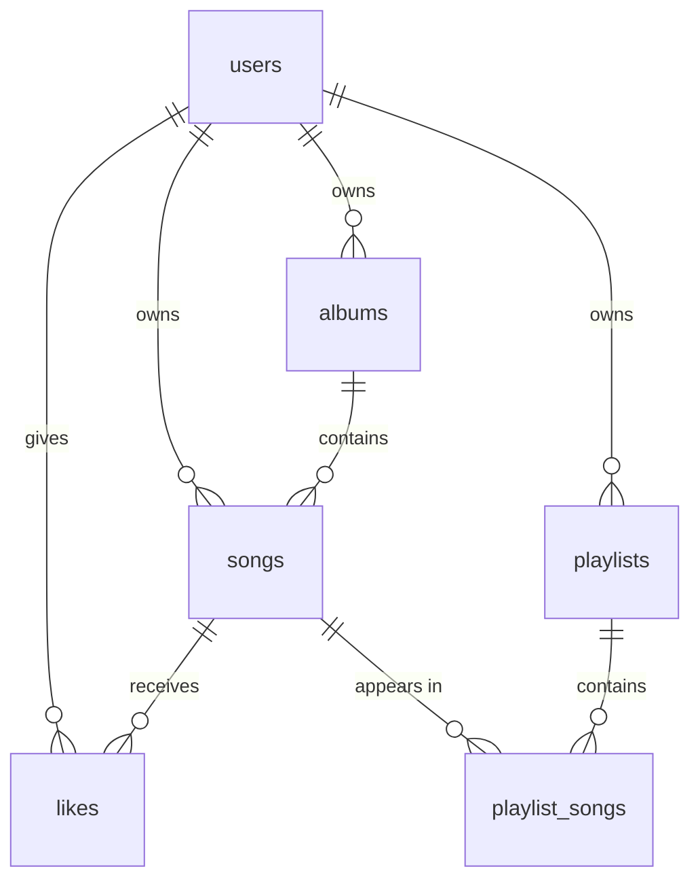

# Database schema

The tables the models in `app/models/` define, which the migrations in
`migrations/versions/` create. `tests/test_docs.py` checks this file against
the models: every table and column, its type, and whether it can be null.

- **Types** are SQLAlchemy's generic names. On Postgres, `datetime` is
  `timestamp without time zone`, and `varchar` without a length is unbounded.
- **Timestamps** are stored in UTC. `updated_at` changes whenever the row does.
- **Foreign keys** are all `on delete cascade`, and the models cascade the same
  deletes in Python. Deleting a user deletes everything they made or liked.
- **In production** every table lives in the Postgres schema named by the
  `SCHEMA` environment variable. In development, on SQLite, there is no schema.

## `users`

| column | type | details |
|---|---|---|
| `id` | integer | primary key |
| `username` | varchar(40) | not null, unique |
| `email` | varchar(255) | not null, unique |
| `hashed_password` | varchar(255) | null for accounts made through Google, and for the seed library's account |
| `oauth_provider` | varchar(20) | `'google'` for an account linked to Google, otherwise null |
| `oauth_id` | varchar(255) | the provider's own id for the user, otherwise null |
| `created_at` | datetime | not null |
| `updated_at` | datetime | not null |

`oauth_provider` and `oauth_id` are unique together (`uq_users_oauth`), so one
Google account can only be linked to one user.

A user has many `albums`, `songs`, `likes` and `playlists`.

## `albums`

| column | type | details |
|---|---|---|
| `id` | integer | primary key |
| `name` | varchar(255) | not null |
| `user_id` | integer | not null, foreign key to `users.id`; the album's owner |
| `art` | varchar(255) | cover image URL; null when there is none |
| `artist` | varchar(50) | not null |
| `year` | integer | not null |
| `genre` | varchar(50) | not null |
| `created_at` | datetime | not null |
| `updated_at` | datetime | not null |

An album has many `songs`.

## `songs`

| column | type | details |
|---|---|---|
| `id` | integer | primary key |
| `name` | varchar(255) | not null |
| `user_id` | integer | not null, foreign key to `users.id`; the song's owner, always the album's |
| `album_id` | integer | not null, foreign key to `albums.id` |
| `duration` | integer | not null; whole seconds |
| `song_url` | varchar(255) | not null; the audio file in S3 |
| `track_number` | integer | not null |
| `created_at` | datetime | not null |
| `updated_at` | datetime | not null |

A song has many `likes` and `playlist_songs`.

## `likes`

| column | type | details |
|---|---|---|
| `id` | integer | primary key |
| `song_id` | integer | not null, foreign key to `songs.id` |
| `user_id` | integer | not null, foreign key to `users.id`; who liked it |
| `created_at` | datetime | not null |
| `updated_at` | datetime | not null |

`song_id` and `user_id` are unique together (`uq_likes_song_user`): one like
per user per song.

## `playlists`

| column | type | details |
|---|---|---|
| `id` | integer | primary key |
| `user_id` | integer | not null, foreign key to `users.id`; the playlist's owner |
| `title` | varchar | not null |
| `art` | varchar | cover image URL; null when there is none |
| `description` | varchar | |
| `created_at` | datetime | not null |
| `updated_at` | datetime | not null |

A playlist has many `playlist_songs`, in `id` order, which is the order they
were added in.

## `playlist_songs`

One entry in a playlist. The same song can appear in a playlist more than once,
as separate rows.

| column | type | details |
|---|---|---|
| `id` | integer | primary key |
| `song_id` | integer | not null, foreign key to `songs.id` |
| `playlist_id` | integer | not null, foreign key to `playlists.id` |
| `created_at` | datetime | not null |
| `updated_at` | datetime | not null |
